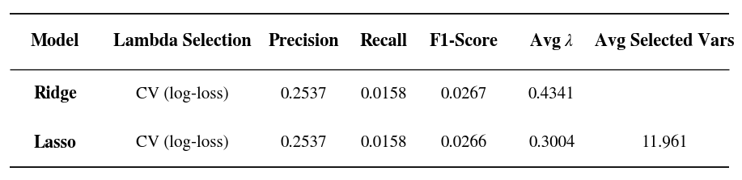
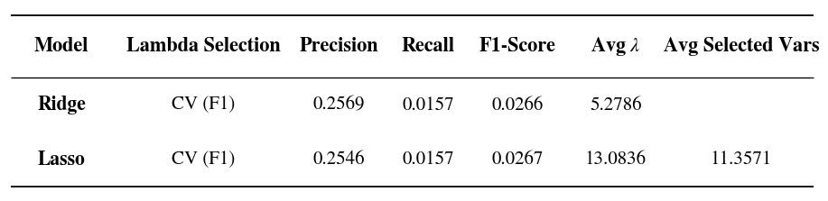
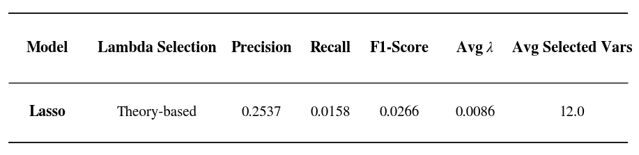
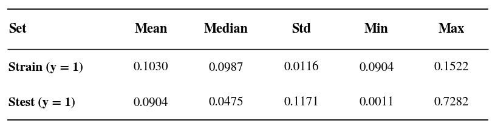
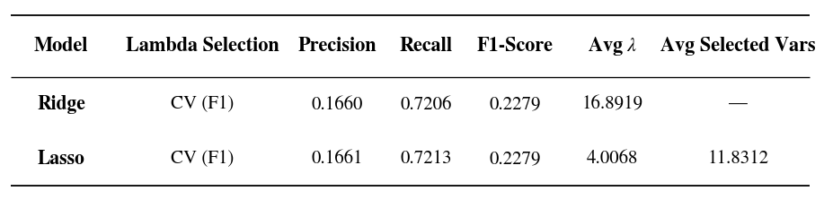
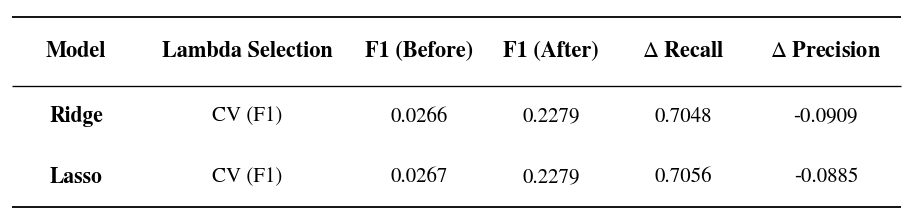
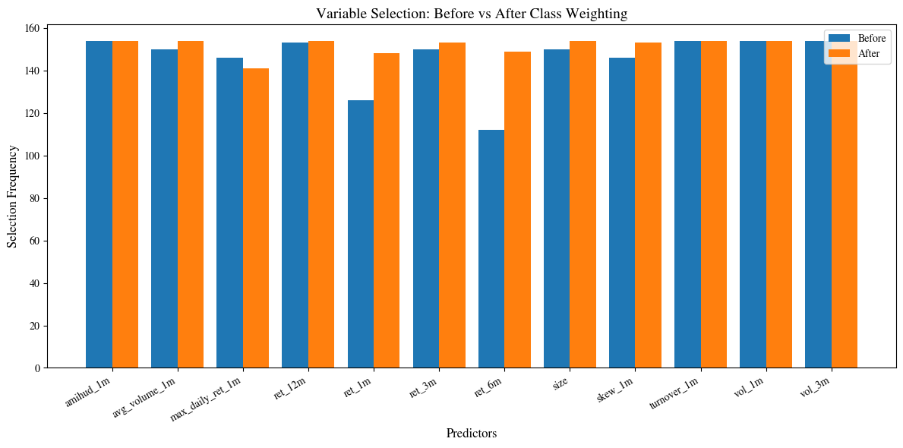

# Ridge and Lasso for Classification

## Overview
This project explores the predictive power of regularized logistic regression—Lasso and Ridge in forecasting stock market crashes

## Data
- Taiwan stock data (daily)  
**Source:** TEJ (Taiwan Economic Journal)  
**Time Period:** 2010-01-01 to 2025-12-31

## Predictors
The predictors are constructed from daily data and grouped into several economic categories:

- Reversal / Momentum
  - 1M return (short-term reversal)
  - 3M, 6M, 12M returns (momentum)
- Risk
  - 1M volatility
  - 3M volatility
- Liquidity
  - Turnover (1M)
  - Average volume (1M)
  - Amihud illiquidity
- Extreme / Lottery
  - Maximum daily return (1M)
  - Return skewness (1M)
- Firm characteristics
  - Size (log market capitalization)

All predictors are cross-sectionally standardized within each month.  
Target variable is the next-month return.

## Binary Labels
$Y_{i}$ = 1{$Asset Return_{i}$ ≤ −10%}, where $Y_{i}$ = 1 indicates a ‘crash’ event, $Y_{i}$ = 0 otherwise
-  If there's no −10% observations in $S_{train}$, then
pick 25%-quantile as the threshold instead

## $S_{train}$  $S_{test}$
**Expanding Window:**
- At each time ( t ):
  - Train on all data up to ( t )
  - Predict returns at ( t+1 )

- This ensures strictly out-of-sample evaluation and avoids look-ahead bias
- Allows the model to capture time-varying loadings, reflecting how factor exposures shift as new market data is incorporated

## 5-Fold Cross-Validation
This approach prevents look-ahead bias by ensuring that future data is never used to predict the past
1. Data is sorted by month to maintain time-series integrity

2. Select multiple validation points (approx. 5) along the timeline. For each point $t$:
  - Train: The model learns from all observations from the beginning up to month $t$
  - Validate: The model is evaluated on month $t+1$

## Baseline Classification

### Log-loss Optimized Models
- Evaluate ridge and lasso models using CV to select the regularization parameter λ by **minimizing the average log-loss** across all validation steps.

### F1-score Optimization
- Select $\lambda$ by **maximizing the average F1-score.** This shifts the objective from probability calibration to a balance between precision and recall.

### Scaled Lasso
- $\lambda = \sqrt{\frac{2 log p}{n}}$, where p is the number of predictors.

### Key Findings
- Both CV and theory-based $\lambda$ lead to nearly identical performance

- Low recall across all models

- This indicates that the fundamental issue lies in the severe class imbalance, which causes the models to overwhelmingly predict the majority class and fail to detect crash events.

## Class Imbalance

### Class Distribution

### Chosen Method
Adopt **class weighting** as our adjustment method.
- Given the large sample size and the imbalance ratio $\rho \leq 10$ 
  - $\rho = \frac{w_{+}}{w_{-}}$
  - $w_{+} = \frac{n}{2n_{+}}, \ w_{-} = \frac{n}{2n_{-}}$ 

### Balanced Ridge and Lasso
- While both Log-loss and F1-score criteria were tested and the outcomes are highly consistent.

- Present the F1-optimized results as the representative balanced models.

### Comparison

**1. Confusion Matrix**

**2. Variables Selection**

### Key Observation

1. Models show a significant improvement in recall, successfully identifying a much larger proportion of crash events. 

2. Lower precision, as the decision boundary shifts to accommodate rare events. 

3. The overall F1-score increases, indicating a better balance between precision and recall.

These results indicate that the key challenge in this classification problem is the severe class imbalance rather than the choice of regularization parameter or model specification.